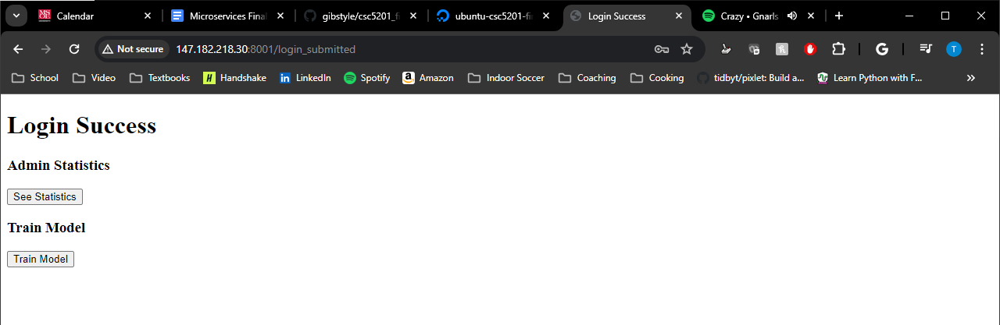

# CSC 5201 Final Project - Restaurant Review Application
## Description of Application
This application involves using predicting if a textual review is good or bad for a restaurant. A machine learning model is trained on various number of reviews from two kaggle datasets that can predict a rating of good or bad of a review. There are two incorporate microservices that communicate over the network. Docker Compose is used to perform container ochestration over multiple containers (one container for each microservice). Databases and tables are used to store reviews and metadata of the reviews, admin users, and statistics of various endpoints of the main application.


## Repository Directories
### load_testing
This directory contains a file to start a load test on the Restaurant Review Prediction Application.

### post_reviews_csv
This directory contains two Kaggle Datasets and a python script to create reviews into the Restaurant Review Service API.

### restaurant_review_service
This directory contains the Restaurant Review Service API and related files for it.

### review_predictions_service
This directory contains the Restaurant Review Prediction Application and related files for it.


## Instructions for Installation
1. Create a [Droplet](https://docs.digitalocean.com/products/droplets/how-to/create/) on DigitalOcean
- Choose your appropriate region
- Choose the Ubuntu Image, Version 23.10 x64 
- Choose any droplet type for size
  - I am using the basic 1GB / 25 GB Disk
- Choose either authentication method
  - I am using a SSH key
- Optional
  - Backups
  - Additional Storage

2. Connect to the Droplet
- I connect via the Droplet Console

3. Setup the Server
- Follow this [tutorial](https://www.digitalocean.com/community/tutorials/initial-server-setup-with-ubuntu-20-04) to setup the server

4. Install Docker
- Follow this [tutorial](https://www.digitalocean.com/community/tutorials/how-to-install-and-use-docker-on-ubuntu-20-04) to install docker on the droplet

5. Install Docker Compose
- Follow this [tutorial](https://www.digitalocean.com/community/tutorials/how-to-install-and-use-docker-compose-on-ubuntu-20-04) to install docker compose

6. Clone this Repo into the Droplet
```
git clone https://github.com/gibstyle/csc5201_final_project.git
```

7. Change Directory to Cloned Repo
```
cd csc5201_final_project
```

8. Build the Containers
```
docker compose build
```

9. Start the Containers
```
docker compose up -d
```
For scaling: 
```
docker compose up -d --scale review_predictions_service=3
```

10. Connect to the App by Accessing Droplet IP in Browser 
```
<droplet_ip>:8001
```

11. Credentials for Admin
- Username: master
- Password: password123


## Documentation of Application with Use Cases
### Architecture Diagram


### Restaurant Review Service
#### Python Flask App
The python flask app asks as a REST API which contains endpoints where users can create, update, delete, and get reviews. There additionally are endpoints to get all of the current restaurants in the database. Lastly, there is an endpoint to get reviews and ratings data for training a machine learning model for natural language processing or other realted tasks.

#### SQLite Database
The database contains one table. The "Review" table stores a review id, restaurant name, review, rating, and creation data.

### Review Prediction Service
#### Python Flask App
The python flask app services as a REST app that has a few capabilities:
- Make a GET request to the Restaurant Review Service API to get a sample of reviews to display on the webpage
- Make a GET request to the Restaurant Review Service API to get all of the restaurants in the database
- Predict a rating for a review
  - Enter a text review into the application to get a rating on if the review is good or bad.
- Administrative login to:
  - View endpoint statistics for the application
  - Train a new machine learning model using data through a GET request from the Restaurant Review Service API
    - The machine learning model is a random forest classifier using a TF-IDF vectorizer
- Log file
  - A log file is created which stores inputted reviews and usernames/passwords

#### SQLite Database
The database contains two tables. The "Statistics" table stores application statistics of when endpoints are reached in the flask app. The "Admin" table stores admin user and password information to authenticate them to reach protected endpoints.

### Use Cases
#### Landing Page


#### Viewing Sample Reviews


#### Viewing All Restaurants


#### Login


#### Login Success


#### Login Failure


#### Statistics


#### Train Model


#### Make Prediction


#### Prediction Result

